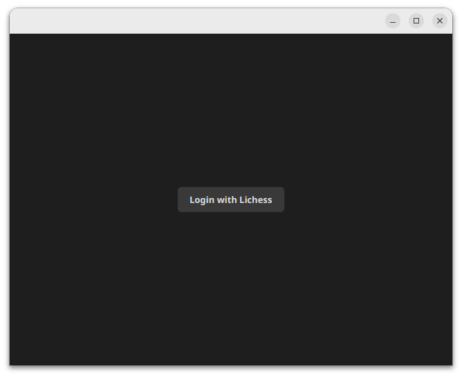
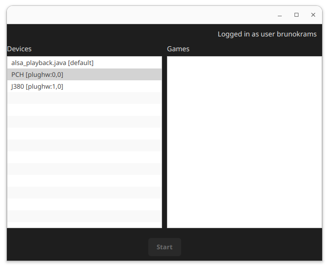
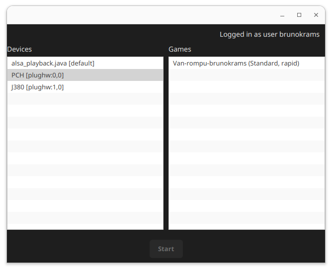
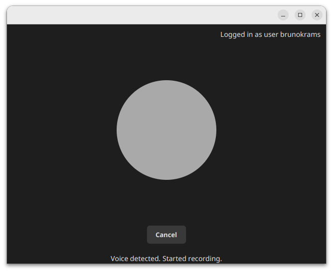

# Voice Control for lichess.org

[](https://opensource.org/licenses/mit)

This is a project that allows you to control your chess games on lichess using voice commands.
It uses the OpenAI API to process your voice commands and translate them into moves on the chessboard. To narrow down
the number of possible moves, the current position of the chess game is read from lichess and passed to [Chesslib](https://github.com/bhlangonijr/chesslib).

## Usage
To use it you must have a lichess account and an OpenAI API-Key with some quota. 
The OpenAI API-Key must be provided as an environment variable named "OPENAI_API_KEY".
To run the application you can use the following command:
```bash
mvn clean javafx:run
```
Make sure that you have JavaFX installed and properly configured in your environment. You can find more information
about setting up JavaFX in the [official documentation](https://openjfx.io/).

Once you start the application, it will prompt you to log in to your lichess account. After logging in, you see a list
of your ongoing games. Note that at the time being (2026-03-11) lichess game-API is restricted to games with a time control of at
least rapid.

## Hints
Currently only commands in german language are supported.
To make a move you must provide the piece, the origin square and the target square. E.g.: "König a4 auf a3".

## Screenshots





